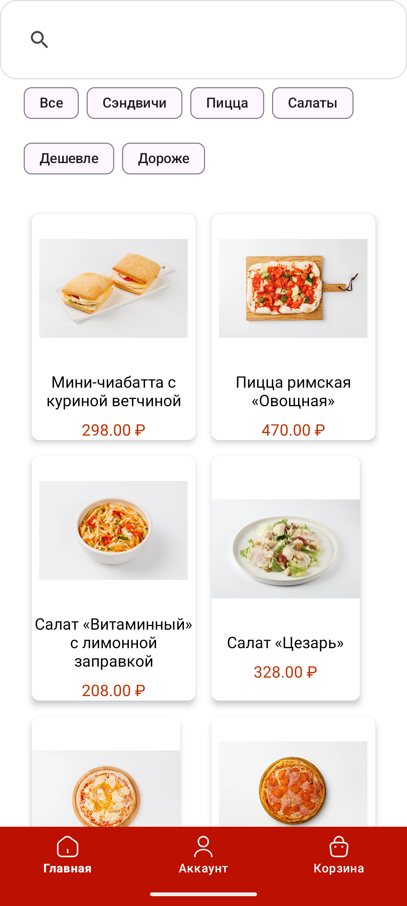
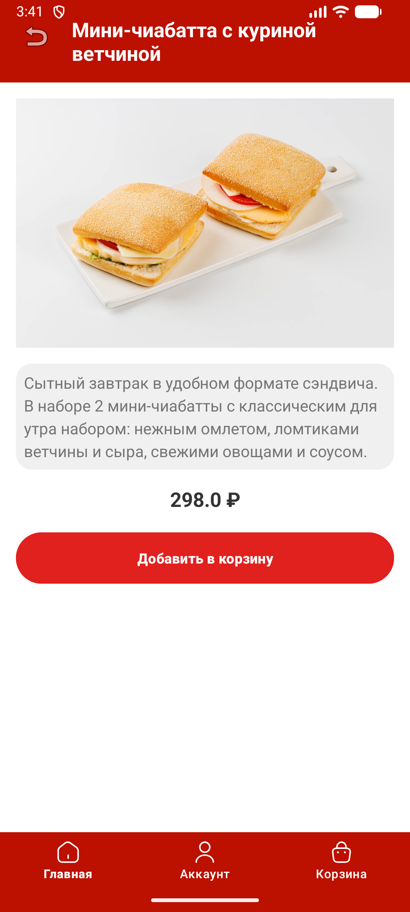
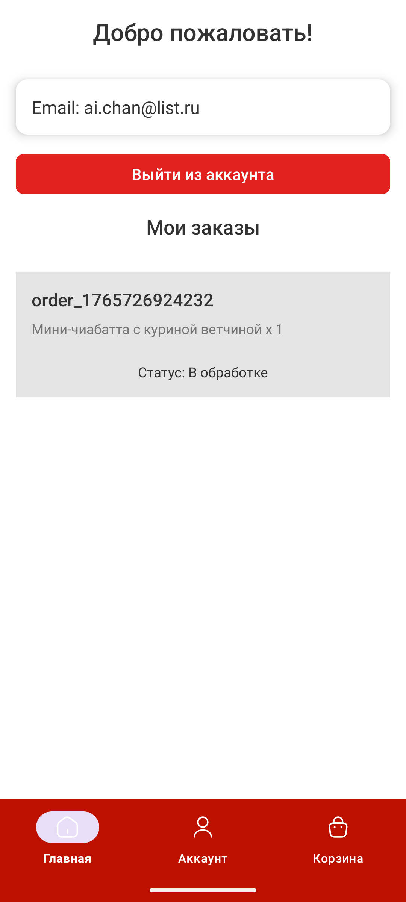

# 🍕 YummyRun — Закажи еду быстро и вкусно!

Android-приложение для онлайн-заказа еды: сэндвичи, салаты, пицца и не только. Просматривай меню,
добавляй товары в корзину, оформляй заказы — всё в удобном интерфейсе с поддержкой Firebase Auth!



---

## 🌟 Основные возможности

- 🔐 **Авторизация и регистрация** через Firebase Authentication
- 🛒 **Корзина товаров** с изменением количества и удалением позиций
- 🍽️ **Каталог блюд** с изображениями, описаниями и ценами
- 🔍 **Поиск** по названию блюда
- 🧩 **Фильтрация по категориям**: сэндвичи, пицца, салаты
- ⬆️⬇️ **Сортировка по цене**: от дешёвых к дорогим и наоборот
- 📦 **Оформление заказа** с подтверждением через диалог
- 📋 **История заказов** в личном кабинете
- 🔄 **Навигация** через Bottom Navigation (Главная, Корзина, Аккаунт)

---

## 🛠 Технологии и архитектура

- **Язык**: Java (Android)
- **Архитектура**: Activity + Fragment-free, Bottom Navigation
- **UI**: Material Design, RecyclerView, SearchView, Chips
- **Аутентификация**: Firebase Authentication
- **Хранение данных**:
    - **Корзина и заказы** — `SharedPreferences`
    - **Каталог блюд** — хардкод в `HomeActivity` (статический список)
- **Сериализация**: `Serializable` для передачи объектов между Activity
- **Библиотеки**:
    - `androidx.recyclerview:recyclerview`
    - `com.google.firebase:firebase-auth`
    - `com.google.android.material`

---

## 🗂 Структура проекта

```
com.shop.yummyrun/
├── adapter/
│ ├── CartAdapter.java → Адаптер корзины с управлением количеством
│ ├── OrderAdapter.java → Адаптер истории заказов
│ └── ProductAdapter.java → Адаптер каталога блюд
├── model/
│ ├── CartItem.java → Элемент корзины
│ ├── Order.java → Заказ
│ └── Product.java → Блюдо (название, описание, цена, категория, изображение)
├── ui/
│ ├── splash/SplashActivity.java
│ ├── login/LoginActivity.java
│ ├── registration/RegistrationActivity.java
│ ├── home/HomeActivity.java → Главный экран с каталогом
│ ├── product/ProductDetailActivity.java
│ ├── cart/CartActivity.java → Корзина
│ ├── account/AccountActivity.java → Личный кабинет с историей заказов
│ └── checkout/ConfirmOrderDialog.java → Диалог подтверждения
```

---

## 💾 Хранение данных

- **Корзина** сохраняется в `SharedPreferences` в виде строки формата:  
  `название|цена|количество|ресурсы_изображения;...`
- **Заказы** хранятся в отдельном `SharedPreferences`-файле `orders` с ключом `order_123456789`

---

## 📦 Пример блюда

```
new Product(
  "Пицца 4 сыра",
          "Аппетитная пицца для любителей сыра...",
          488,
  R.drawable.pizza2,
  "Пицца"
)
```

---

## 📸 Скриншоты

| Экран | Изображение |
|-------|-------------|
| **Страница регистрации** |  |
| **Страница авторизации** |  |
| **Модальное окно для восстановления пароля** |  |
| **Главный экран** |  |
| **Детали товара** |  |
| **Добавление товара в корзину** |  |
| **Корзина** |  |
| **Аккаунт** |  |
